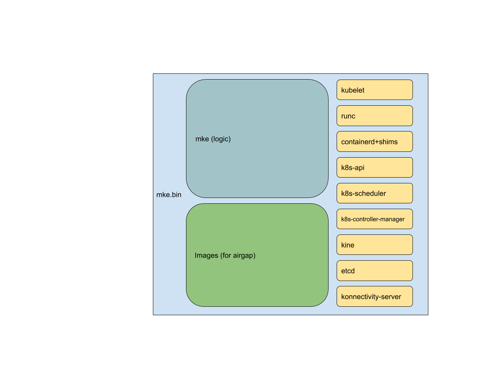
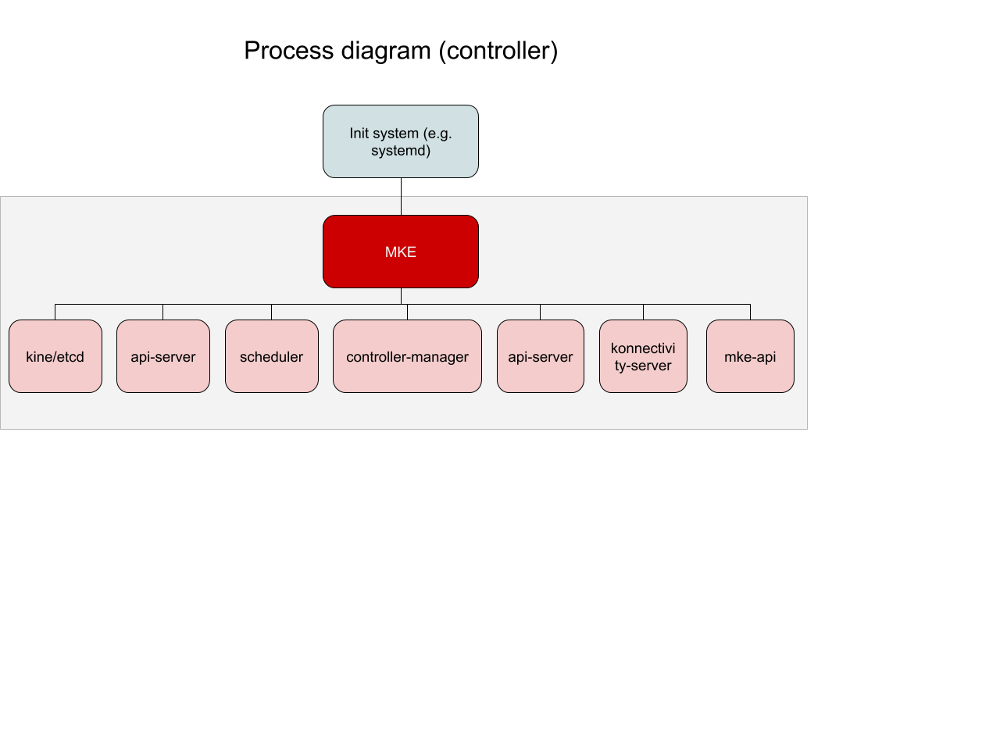
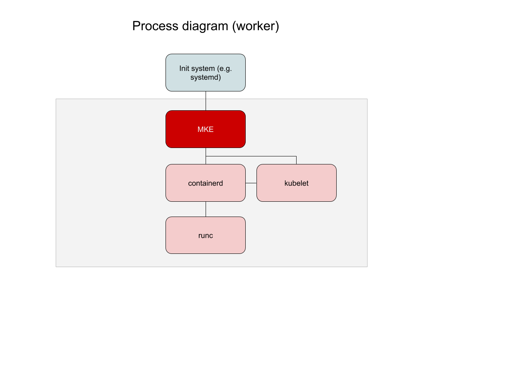

# Architecture

**Note:** As with any young project, things change rapidly. Thus all the details in this architecture documentation may not be always up-to-date, but the high level concepts and patterns should still apply.

## Packaging

MKE is packaged as sinlge binary. This has many benefits:
- Everything can, and is, statically compiled
- No OS level deps
- No RPMs, dep's, snaps or any other OS specific packaging needed. Single "package" for all OSes
- We can fully control the versions of each and every dependency

## Control plane

MKE as a single binary acts as the process supervisor for all other control plane components. This means there's no container engine running on controllers and also no kubelet (by default). This means there is no way for a cluster user to schedule workloads onto controller nodes.

MKE creates, manages and configures each of the components. MKE runs all control plane components in "naked" processes. So on the controller node there's no container engine running.

### Storage

Typically Kubernetes control plane uses only etcd as the datastore. This is possible with MKE too, but we also offer some other options. This is achieved by including [kine](https://github.com/rancher/kine/). Kine allows wide variety of backend data stores to be used such as MySQL, PostgreSQL, SQLite and dqlite. See more in storage [documentation](configuration.md#spec.storage)

In case of MKE managed etcd, MKE manages the full lifecycle of the etcd cluster. This means for example that by joining a new controller node with `mke server "long-join-token"` MKE will automatically adjust the etcd cluster membership info to allow the new member to join the cluster.

**Note:** Currently MKE cannot shrink the etcd cluster. For now user needs to manually remove the etcd member and only after that shutdown the mke controller on the removed node.

## Worker plane

As for the control plane, MKE creates and manages the core worker components as naked processes on the worker node. Currently we support only [containerd](containerd.io) as the container engine.

