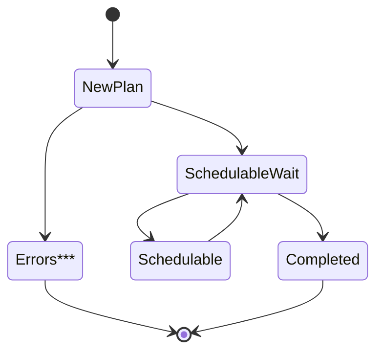
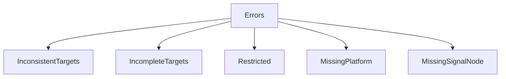
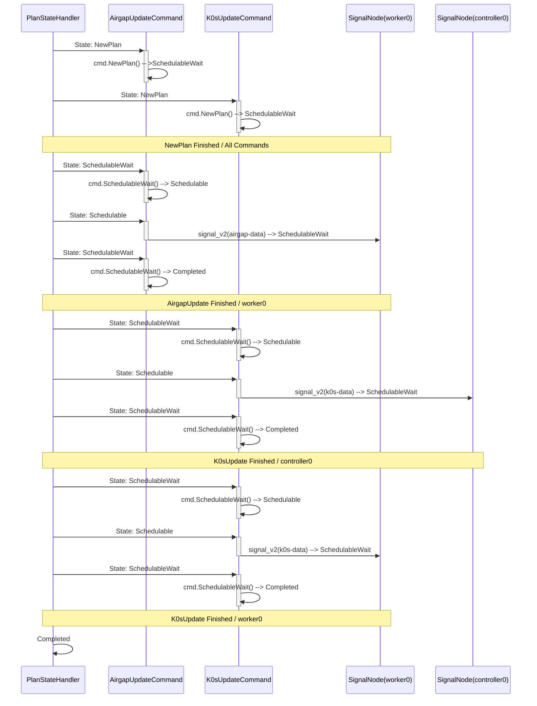

# **Multi-Command Plans**

**Autopilot** relies on a **Plan** for defining the **Commands** that should be
executed, the **Signal Nodes** that each should be run on, and the status of
each **Command**.

A **Plan**:

* Defines one or many **Commands** that specify what actions should be performed.
* Specifies how **Signal Nodes** should be discovered per-**Command**.
* Saves the status of the **Plan** execution by resolved **Signal Nodes**

A **Command**:

* An instructional step inside of a **Plan** that is applied against a **Signal Node**

A **Signal Node**:

* Any node (controller or worker) that can receive updates with Autopilot.

## **Execution**

The execution of a **Plan** is the result of processing **Commands** through
a number of **Processing States**.

When a **Plan** is executed, each of the **Commands** are executed in the order
of their appearance in the **Plan**.

* A **Plan** transitions to the next **Command** only when the current **Command** posts
a state of **Completed**.
* Any **Command** that posts one of the recognized **Error States** will result in the
current **Command** and **Plan** to abort processing.
  * The status of the **Command** and **Plan** will reflect this.
* A **Plan** is considered finished only when all of its defined **Commands** post a
**Completed** state.

## **Status**

The progress and state of each **Command** is recorded in the **Plan** status.

* Every **Command** in the **Plan** has an associated status entry with the same index
as the **Command**
  * ie. The second **Command** in a **Plan** has an index of `1`, and so does its status.
* The status of all **Commands** is taken into consideration when determining if the
**Plan** is finished.

---

## **Example**

The following is an example of a **Plan** that has been applied as is currently being
processed by **autopilot**.

(line numbers added for commentary below)

```yaml
 1: apiVersion: autopilot.k0sproject.io/v1beta2
 2:  kind: Plan
 3:  metadata:
 4:    annotations:
 5:      <omitted>
 6:  spec:
 7:    commands:
 8:    - airgapupdate:
 9:        version: v{{{ extra.k8s_version }}}+k0s.0
10:        platforms:
11:          linux-amd64:
12:            url: https://github.com/k0sproject/k0s/releases/download/v{{{ extra.k8s_version }}}+k0s.0/k0s-airgap-bundle-v{{{ extra.k8s_version }}}+k0s.0-amd64
13:        workers:
14:          discovery:
15:            static:
16:              nodes:
17:              - worker0
18:    - k0supdate:
19:        version: v{{{ extra.k8s_version }}}+k0s.0
20:        platforms:
21:          linux-amd64:
22:            url: https://github.com/k0sproject/k0s/releases/download/v{{{ extra.k8s_version }}}+k0s.0/k0s-v{{{ extra.k8s_version }}}+k0s.0-amd64
23:        targets:
24:          controllers:
25:            discovery:
26:              static:
27:                nodes:
28:                - controller0
29:          workers:
30:            discovery:
31:              static:
32:                nodes:
33:                - worker0
34:    id: id123
35:    timestamp: now
36:  status:
37:    commands:
38:    - airgapupdate:
39:        workers:
40:        - lastUpdatedTimestamp: "2022-05-11T19:13:02Z"
41:          name: worker0
42:          state: SignalSent
43:      id: 0
44:      state: SchedulableWait
45:    - id: 1
46:      k0supdate:
47:        controllers:
48:        - lastUpdatedTimestamp: "2022-05-11T19:13:02Z"
49:          name: controller0
50:          state: SignalPending
51:        workers:
52:        - lastUpdatedTimestamp: "2022-05-11T19:13:02Z"
53:          name: worker0
54:          state: SignalPending
55:      state: SchedulableWait
56:    state: SchedulableWait
```

* Lines **7-33** are the two **Commands** that make up this plan -- an `airgapupdate` and `k0supdate`.
* Lines **38-55** are the associated status entries for the two **Commands**.

The state of this **Plan** exerpt is that **autopilot** has successfully processed the **Plan**, and
has begun processing the `airgapupdate` **Command**. Its status indicates **SignalSent** which means
that the **Signal Node** has been sent signaling information to perform an airgap update.

---

## **Processing States**

The following are the various states that both `Plan`s and `Command`s
adhere to.



Note that the **Errors*** state is elaborated in detail below in **Error States**.

### **NewPlan**

When a **Plan** is created with the name `autopilot`, the **NewPlan** state
processing takes effect.

It is the responsibility of **NewPlan** to ensure that the status of **all**
the **Commands** are represented in the **Plan** status. This **Plan** status
is needed at later points in **Plan** processing to determine if the entire
**Plan** is completed.

The main difference between **NewPlan** and all the other states is that
**NewPlan** will iterate over all commands; the other states deal with the
active command.

### **SchedulableWait**

Used to evaluate a **Command** to determine if it can be scheduled for processing.
If the **Command** is determined that it can be processed, the state is set to
**Schedulable**.

### **Schedulable**

The **Schedulable** state is set by **SchedulableWait** to indicate that this
command should execute. The execution of a **Command** in this state will be
whichever logic is defined by the **Command**.

The ending of this state should either transition to **SchedulableWait** for
further processing + completion detection, or transition to an error.

### **Completed**

The **Completed** state indicates that the command has finished processing.
Once a plan/command are in the **Completed** state, no further processing
will occur on this plan/command.

---

## **Error States**

When a plan or command processing goes into one of the designated error
states, this is considered fatal and the plan/command processing will
terminate.

Error states are generally defined by the **Command** implementation.
The core **autopilot** functionality is only interested when in the
4 core states (**NewPlan**, **SchedulableWait**, **Schedulable**, **Completed**),
and treats all other states as an error.



| Error State | Command | States | Description |
|-------------|---------|--------|-------------|
| **InconsistentTargets** | `k0supdate` | **Schedulable** | Indicates that a **Signal Node** probe has failed for any node that was previously discovered during **NewPlan**. |
| **IncompleteTargets** | `airgapupdate`, `k0supdate` | **NewPlan**, **Schedulable** | Indicates that a **Signal Node** that existed during the discover phase in **NewPlan** no longer exists (ie. no `ControlNode` or `Node` object) |
| **Restricted** | `airgapupdate`, `k0supdate` | **NewPlan** | Indicates that a **Plan** has requested an update of a **Signal Node** type that contradicts the startup exclusions (the `--exclude-from-plans` argument) |
| **MissingSignalNode** | `airgapupdate`, `k0supdate` | **Schedulable** | Indicates that a **Signal Node** that existed during the discover phase in **NewPlan** no longer exists (ie. no matching `ControlNode` or `Node` object) |

---

## **Sequence: Example**

Using the example above as a reference, this outlines the basic sequence of events of
state transitions to the operations performed on each object.


