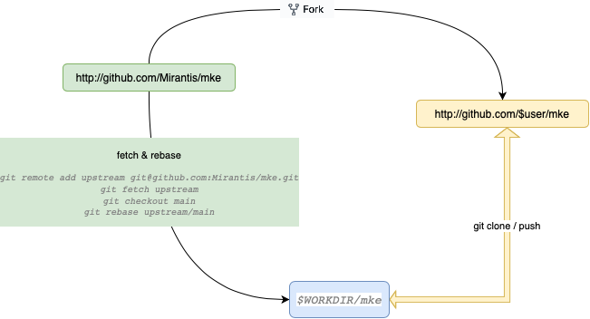

#### 1. Fork The Project
1. Go to http://github.com/Mirantis/mke
2. On the top, right-hand side, click on "fork" and select your username for the fork destination.

#### 2. Clone fork to local directory
Per Go's [workspace instructions](https://golang.org/doc/gopath_code.html#ImportPaths), place mke's repository clone in your GOPATH, per the instructions below:

```
1. export WORKDIR=$(go env GOPATH)/src/github.com/Mirantis
2. mkdir -p $WORKDIR
```
If you already have a few development projects from github, the `github.com` directory will already exist.
```
export user={ your github's profile name }
```

Clone the project
```
cd $WORKDIR

# create ${GOPATH}/Mirantis/mke with your forked repo
git clone https://github.com/$user/mke.git 
```
Configure the Upstream Remote
```
cd $WORKDIR/mke
git remote add upstream git@github.com:Mirantis/mke.git

# Never push to upstream main
git remote set-url --push upstream no_push

# Confirm that your remotes make sense:
git remote -v
```
#### 3. Create a feature branch

First, make sure your local fork is up-to-date:
```
cd $WORKDIR/mke
git fetch upstream
git checkout main
git rebase upstream/main
```
Create a feature branch:
```
git branch -b my_feature_branch
```
##### Make sure your feature builds
Build instructions can be found [here](https://github.com/Mirantis/mke/blob/fba8a20cef8a66f6ae1e4f5ec248591085e02aa5/README.md#build)

#### 4. Keep your branch in sync
```
# While on your my_feature_branch branch
git fetch upstream
git rebase upstream/main
```
Please don't use `git pull` instead of the above `fetch / rebase`. `git pull` does a merge, which leaves merge commits. These make the commit history messy and violate the principle that commits ought to be individually understandable and useful (see below). You can also consider changing your `.git/config` file via `git config branch.autoSetupRebase always` to change the behavior of `git pull`, or another non-merge option such as `git pull --rebase`.

#### 5. Commit

Commit and sign your changes.

```
git commit -m "my commit title" --signoff
```
You can go back and edit/build/test some more, then `commit --amend` in a few cycles.

#### 6. Push

When ready to review (or just to establish an offsite backup of your work), push your branch to your fork on github.com:

```
git push -f origin my_feature_branch
```

#### 7. Create a pull request

Visit your fork at https://github.com/$user/mke
Click the `Compare & Pull Request` button next to your my_feature_branch branch.

##### Get a code review

Once your pull request has been opened it will be assigned to one or more reviewers. Those reviewers will do a thorough code review, looking for correctness, bugs, opportunities for improvement, documentation and comments, and style.

Commit changes made in response to review comments should be added to the same branch on your fork.

Very small PRs are easy to review. Very large PRs are very difficult to review.

##### Squash commits

After a review, prepare your PR for merging by squashing your commits.

All commits left on your branch after a review should represent meaningful milestones or units of work. Use commits to add clarity to the development and review process.

Before merging a PR, squash the following kinds of commits:

* Fixes/review feedback
* Typos
* Merges and rebases
* Work in progress

Aim to have every commit in a PR compile and pass tests independently if you can, but it's not a requirement. In particular, `merge commits` must be removed, as they will not pass tests.

To squash your commits, perform an interactive rebase:
1. Check your git branch:
   ```
   git status
   ```

   Output is similar to:
   ```
   Your branch is up to date with 'origin/my_feature_branch'.
   ```
2. Start an interactive rebase for your PR commits. If you PR has 3 commits, count backwards from your last commit using HEAD~<n>, where <n> represents the number of commits to include in the rebase.
   ```
   git rebase -i HEAD~3
   ```
   Output is similar to:
   ```
   pick 2ebe926 Original commit
   pick 31f33e9 Address feedback
   pick b0315fe Second unit of work
   
   # Rebase 7c34fc9..b0315ff onto 7c34fc9 (3 commands)
   #
   # Commands:
   # p, pick <commit> = use commit
   # r, reword <commit> = use commit, but edit the commit message
   # e, edit <commit> = use commit, but stop for amending
   # s, squash <commit> = use commit, but meld into previous commit
   # f, fixup <commit> = like "squash", but discard this commit's log message
   
   ...
   ```
3. Use a command line text editor to change the word `pick` to `fixup` for the commits you want to squash, then save your changes and continue the rebase:
   ```
   pick 2ebe926 Original commit
   squash 31f33e9 Address feedback
   pick b0315fe Second unit of work
   ...
   ```
   
   Output (after saving changes) is similar to:
   ```
   [detached HEAD 61fdded] Second unit of work
    Date: Thu Mar 5 19:01:32 2020 +0100
    2 files changed, 15 insertions(+), 1 deletion(-)
    ...
   Successfully rebased and updated refs/heads/main.
   ```

4. Force push your changes to your remote branch:
   ```
   git push --force
   ```

