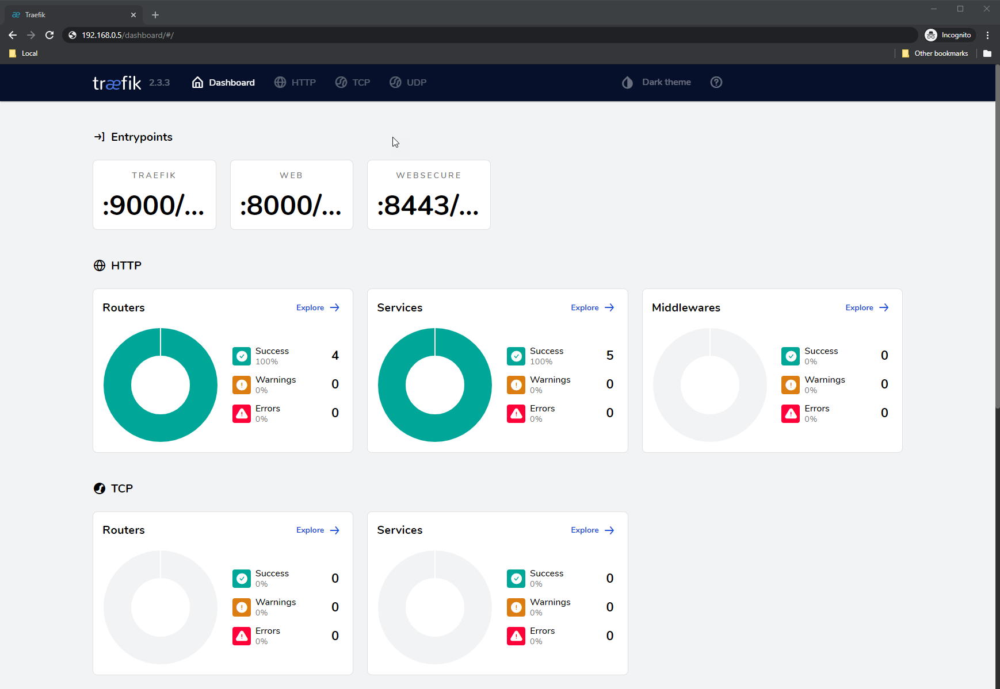

<!--
SPDX-FileCopyrightText: 2020 k0s authors
SPDX-License-Identifier: CC-BY-SA-4.0
-->

# Installing Traefik Ingress Controller

You can configure k0s with the [Traefik Ingress Controller], a [MetalLB service load balancer], and deploy the Traefik Dashboard using a service sample. To do this you leverage Helm's extensible bootstrapping functionality to add the correct extensions to the `k0s.yaml` file during cluster configuration.

[Traefik Ingress Controller]: https://doc.traefik.io/traefik/getting-started/quick-start-with-kubernetes/
[MetalLB service load balancer]: https://metallb.io/

## Install Traefik and MetalLB

Configure k0s to install Traefik and MetalLB during cluster bootstrapping by adding their [Helm charts](../helm-charts.md) as extensions in the k0s configuration file (`k0s.yaml`).

**Note:**
A good practice is to have a small range of IP addresses that are addressable on your network, preferably outside the assignment pool your DHCP server allocates (though any valid IP range should work locally on your machine). Providing an addressable range allows you to access your load balancer and Ingress services from anywhere on your local network.

```yaml
extensions:
  helm:
    repositories:
      - name: traefik
        url: https://traefik.github.io/charts

      - name: metallb
        url: https://metallb.github.io/metallb

    charts:
      - name: traefik
        chartname: traefik/traefik
        version: "39.0.1"
        namespace: traefik-system

      - name: metallb
        chart: metallb/metallb
        version: "0.15.3"
        namespace: metallb-system
```

## Configure traefik

If you want to configure Traefik via the Helm Chart, you can do this by providing values in the `extensions.helm.charts` section. For more infos check out the [Helm Chart docs](../helm-charts.md).

### Enable automatic http to https redirect

To automatically redirect http requests to https, set the following config via the `values` section:

```yaml
extensions:
  helm:
    repositories: ...

    charts:
      - name: traefik
        chartname: traefik/traefik
        version: "39.0.1"
        namespace: traefik-system
        values: |
          ports:
            web:
              http:
                redirections:
                  entryPoint:
                    to: websecure
                    scheme: https
                    permanent: true

      - name: metallb
        ...
```

### Add new entrypoints

Traefik can be configured to add new entrypoints which serve to accept traffic via a specified port. This can either be via the [http(s) load-balancer](https://doc.traefik.io/traefik/reference/routing-configuration/kubernetes/crd/http/ingressroute/), or the [tcp/udp load-balancer](https://doc.traefik.io/traefik/reference/routing-configuration/kubernetes/crd/tcp/ingressroutetcp/).
For detailled infos check out the [official docs](https://doc.traefik.io/traefik/reference/install-configuration/entrypoints/).

To add a new entrypoint which can be used by `IngressRoute` or `IngressRouteTCP/IngressRouteUDP` CRD, set the following config via the `values` section:

```yaml
extensions:
  helm:
    repositories: ...

    charts:
      - name: traefik
        chartname: traefik/traefik
        version: "39.0.1"
        namespace: traefik-system
        values: |
          ports:
            ssh: # name of the entrypoint
              port: 2222 # port inside the container
              expose:
                default: true
              exposedPort: 22 # port of the load-balancer which is accessed externally
              protocol: TCP # protocol

      - name: metallb
        ...
```

## Create ConfigMap for MetalLB

Next you need to create ConfigMap, which includes an IP address range for the load balancer. The pool of IPs must be dedicated to MetalLB's use. You can't reuse for example the Kubernetes node IPs or IPs controlled by other services.

> For detailed infos about the installation and configuration of MetalLB see the [Extension docs](metallb-loadbalancer.md)

Create a YAML file accordingly, and deploy it: `kubectl apply -f metallb-l2-pool.yaml`

```YAML
---
apiVersion: metallb.io/v1beta1
kind: IPAddressPool

metadata:
  name: first-pool
  namespace: metallb-system

spec:
  addresses:
  - <ip-address-range-start>-<ip-address-range-stop>
  - <ip-address>/<cidr>
  # example for a range
  - 192.168.0.1-192.168.0.5
  # example for a single address with cidr
  - 192.168.0.5/32
---
apiVersion: metallb.io/v1beta1
kind: L2Advertisement

metadata:
  name: example
  namespace: metallb-system
```

## Retrieve the Load Balancer IP

After you start your cluster, run `kubectl get all` to confirm the deployment of Traefik and MetalLB. The command should return a response with the `metallb` and `traefik` resources, along with a service load balancer that has an assigned `EXTERNAL-IP`.

```shell
kubectl get all
```

_Output_:

```shell
NAME                                                 READY   STATUS    RESTARTS   AGE
pod/metallb-1607085578-controller-864c9757f6-bpx6r   1/1     Running   0          81s
pod/metallb-1607085578-speaker-245c2                 1/1     Running   0          60s
pod/traefik-1607085579-77bbc57699-b2f2t              1/1     Running   0          81s

NAME                         TYPE           CLUSTER-IP       EXTERNAL-IP      PORT(S)                      AGE
service/kubernetes           ClusterIP      10.96.0.1        <none>           443/TCP                      96s
service/traefik-1607085579   LoadBalancer   10.105.119.102   192.168.0.5      80:32153/TCP,443:30791/TCP   84s

NAME                                        DESIRED   CURRENT   READY   UP-TO-DATE   AVAILABLE   NODE SELECTOR            AGE
daemonset.apps/metallb-1607085578-speaker   1         1         1       1            1           kubernetes.io/os=linux   87s

NAME                                            READY   UP-TO-DATE   AVAILABLE   AGE
deployment.apps/metallb-1607085578-controller   1/1     1            1           87s
deployment.apps/traefik-1607085579              1/1     1            1           84s

NAME                                                       DESIRED   CURRENT   READY   AGE
replicaset.apps/metallb-1607085578-controller-864c9757f6   1         1         1       81s
replicaset.apps/traefik-1607085579-77bbc57699              1         1         1       81s
```

Take note of the `EXTERNAL-IP` given to the `service/traefik-xxx` load balancer. In this example, `192.168.0.5` has been assigned and can be used to access services via the Ingress proxy:

```shell
NAME                         TYPE           CLUSTER-IP       EXTERNAL-IP      PORT(S)                      AGE
service/traefik-1607085579   LoadBalancer   10.105.119.102   192.168.0.5      80:32153/TCP,443:30791/TCP   84s
```

Receiving a 404 response here is normal, as you've not configured any Ingress resources to respond yet:

```shell
curl http://192.168.0.5
```

```shell
404 page not found
```

## Deploy and access the Traefik Dashboard

With an available and addressable load balancer present on your cluster, now you can quickly deploy the Traefik dashboard and access it from anywhere on your LAN (assuming that MetalLB is configured with an addressable range).

1. Create the Traefik Dashboard [IngressRoute](https://doc.traefik.io/traefik/reference/routing-configuration/kubernetes/crd/http/ingressroute/) in a YAML file:

```yaml
apiVersion: traefik.io/v1alpha1
kind: IngressRoute

metadata:
  name: traefik-dashboard
  namespace: traefik-system

spec:
  entryPoints:
    - web
    - websecure
  routes:
    - match: PathPrefix(`/dashboard`) || PathPrefix(`/api`)
      kind: Rule
      services:
        - name: api@internal
          kind: TraefikService
```

2. Deploy the resource:

```shell
kubectl apply -f traefik-dashboard.yaml
```

_Output_:

```shell
ingressroute.traefik.io/v1alpha1/traefik-dashboard created
```

At this point you should be able to access the dashboard using the `EXTERNAL-IP` that you noted above by visiting `http://192.168.0.5/dashboard/` in your browser:



3. Create a simple `whoami` Deployment, Service, and [Ingress](https://kubernetes.io/docs/concepts/services-networking/ingress/) manifest:

```yaml
apiVersion: apps/v1
kind: Deployment
metadata:
  name: whoami-deployment
spec:
  replicas: 1
  selector:
    matchLabels:
      app: whoami
  template:
    metadata:
      labels:
        app: whoami
    spec:
      containers:
        - name: whoami-container
          image: containous/whoami
---
apiVersion: v1
kind: Service
metadata:
  name: whoami-service
spec:
  ports:
    - name: http
      targetPort: 80
      port: 80
  selector:
    app: whoami
---
apiVersion: networking.k8s.io/v1
kind: Ingress
metadata:
  name: whoami-ingress
spec:
  rules:
    - http:
        paths:
          - path: /whoami
            pathType: Exact
            backend:
              service:
                name: whoami-service
                port:
                  number: 80
```

4. Apply the manifests:

```shell
kubectl apply -f whoami.yaml
```

_Output_:

```shell
deployment.apps/whoami-deployment created
service/whoami-service created
ingress.networking.k8s.io/whoami-ingress created
```

5. Test the ingress and service:

```shell
curl http://192.168.0.5/whoami
```

_Output_:

```shell
Hostname: whoami-deployment-85bfbd48f-7l77c
IP: 127.0.0.1
IP: ::1
IP: 10.244.214.198
IP: fe80::b049:f8ff:fe77:3e64
RemoteAddr: 10.244.214.196:34858
GET /whoami HTTP/1.1
Host: 192.168.0.5
User-Agent: curl/7.68.0
Accept: */*
Accept-Encoding: gzip
X-Forwarded-For: 192.168.0.82
X-Forwarded-Host: 192.168.0.5
X-Forwarded-Port: 80
X-Forwarded-Proto: http
X-Forwarded-Server: traefik-1607085579-77bbc57699-b2f2t
X-Real-Ip: 192.168.0.82
```

## Further details

With the Traefik Ingress Controller it is possible to use third party tools,
such as [ngrok], to go further and expose your load balancer to the world. In
doing this you enable dynamic certificate provisioning through [Let's Encrypt],
using either [cert-manager] or Traefik's own built-in [ACME provider].

[ngrok]: https://ngrok.com/
[Let's Encrypt]: https://letsencrypt.org/
[cert-manager]: https://cert-manager.io/docs/
[ACME provider]: https://doc.traefik.io/traefik/v2.0/user-guides/crd-acme/
